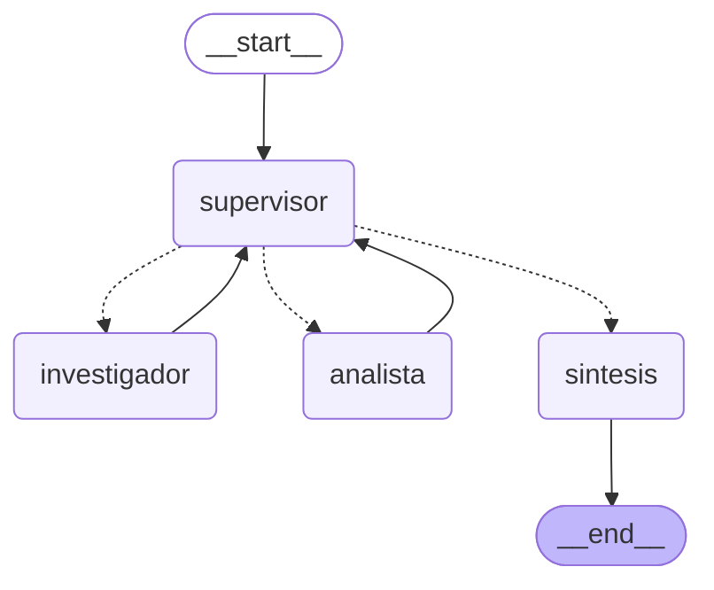

# Orquestador multi-agente de analisis de criticidad

Sistema multi-agente con topologia jerarquica construido con LangGraph. Un nodo
Supervisor coordina a dos agentes especialistas para resolver consultas de
ingenieria de mantenimiento que requieren dos dominios distintos: obtener datos
de planta y calcular indicadores sobre esos datos.

Pre-entrega 6 del curso de AI Engineering (Coderhouse).

## Topologia

Las aristas punteadas son las condicionales que salen del supervisor. Las solidas
son el retorno obligado de cada especialista hacia el supervisor.

### Por que esta topologia

Se eligio una topologia jerarquica con supervisor central en lugar de una cadena
secuencial fija o una red de agentes que se hablan entre si:

- **Frente a la cadena fija:** el orden de los especialistas no esta cableado. El
  supervisor decide en cada vuelta quien interviene segun lo que falta, de modo
  que una consulta que solo requiere datos no pasa por el analista.
- **Frente a la red entre pares:** todos los aportes vuelven a un unico punto de
  control. Eso da un solo lugar donde validar y un solo lugar donde cortar, que
  es lo que evita que el sistema se desborde.

### Como se manejan los conflictos entre agentes

1. **Roles excluyentes.** El prompt de cada especialista le prohibe explicitamente
   invadir el dominio del otro: el investigador no calcula, el analista no busca
   informacion nueva. Las herramientas tambien estan acotadas por rol, asi que la
   separacion no depende solo del prompt.
2. **El supervisor arbitra.** Ningun especialista responde al usuario ni decide el
   paso siguiente. Solo aportan, y el supervisor evalua.
3. **Errores en vez de excepciones.** Cuando una herramienta recibe un codigo
   inexistente devuelve un mensaje informativo listando los codigos validos, en
   lugar de cortar la ejecucion. El supervisor lee ese mensaje y puede volver a
   delegar con el dato corregido.

## Estado compartido

`state.py` define `EstadoOrquestador`, que hereda de `MessagesState` y suma tres
campos propios:

| Campo | Funcion |
|---|---|
| `next_agent` | A quien delega el supervisor en el proximo paso. |
| `contribuciones` | Registro acumulado de que agente aporto que dato. |
| `pasos` | Contador de delegaciones, para cortar bucles. |
| `task_completed` | Bandera que el supervisor levanta al validar el cierre. |

El campo `contribuciones` usa `Annotated[list, operator.add]` como reducer: cada
nodo suma su aporte a la lista en vez de pisarla. Eso es lo que permite rastrear
quien contribuyo con que y evita la perdida de contexto entre agentes.

## Los agentes

**Supervisor** (`graph.py`) — router inteligente. Usa salida estructurada con
Pydantic, de modo que el LLM solo puede responder `investigador`, `analista` o
`FINISH`, mas una justificacion. No hay texto libre que haya que interpretar.

**Investigador** (`agents/`) — agente ReAct acotado a `consultar_historico_fallas`,
que devuelve horas de operacion, cantidad de fallas, horas de parada y costo por
hora de indisponibilidad de un equipo.

**Analista** (`agents/`) — agente ReAct acotado a dos herramientas de calculo:
`calculadora` y `calcular_indicadores_mantenimiento`, que computa MTBF, MTTR,
disponibilidad, costo de indisponibilidad y clasifica la criticidad.

**Sintesis** — fase final. Combina los aportes registrados en una respuesta unica
con recomendacion operativa.

## Validacion y control de bucles

El prompt del supervisor incluye una rubrica explicita. No puede responder FINISH
hasta verificar que:

1. El investigador aporto el historico completo del equipo.
2. El analista aporto los indicadores, incluyendo disponibilidad y criticidad.
3. Ningun aporte contiene un error o un dato faltante.

Sobre eso hay dos cortes duros, porque una rubrica en lenguaje natural no es
garantia suficiente:

- `MAX_PASOS = 6` en `config.py`. El nodo supervisor lo chequea antes de invocar
  al LLM: alcanzado el limite, fuerza el cierre con lo que haya.
- `recursion_limit = 15` pasado en cada invocacion del grafo, como red de
  seguridad a nivel LangGraph.

## Seguridad de la calculadora

La herramienta `calculadora` parsea la expresion con `ast` y evalua solo nodos
aritmeticos permitidos. Usar `eval()` sobre texto generado por un LLM permitiria
ejecutar codigo arbitrario; con el parseo, una entrada como
`__import__('os').system(...)` devuelve un error controlado. Hay un test que lo
verifica.

## Estructura del proyecto

| Archivo | Contenido |
|---|---|
| `state.py` | Esquema del estado compartido con sus reducers. |
| `agents/herramientas_investigacion.py` | Herramienta de consulta de historico de fallas. |
| `agents/herramientas_analisis.py` | Calculadora segura e indicadores de mantenimiento. |
| `agents/especialistas.py` | Construccion de los dos agentes ReAct con sus prompts. |
| `graph.py` | Supervisor, nodos, arista condicional y armado del grafo. |
| `main.py` | Ejecucion en streaming y generacion de la traza. |
| `config.py` | Variables de entorno con validacion al arranque, modelo y limites. |
| `tests/test_orquestador.py` | 11 pruebas de herramientas, enrutamiento y grafo. |
| `traza_delegacion.json` | Traza de una ejecucion real del flujo completo. |

## Como levantar el entorno

    python -m venv .venv
    .venv\Scripts\activate
    pip install -r requirements.txt

Copiar `.env.example` a `.env` y completar las claves. Despues:

    python main.py

Para correr las pruebas:

    pytest -q

## Flujo de delegacion demostrado

La consulta de prueba obliga a intervenir a los dos especialistas, porque los
indicadores no se pueden calcular sin el historico y el historico no dice nada
sobre criticidad.

    Usuario: "Analiza la criticidad del compresor C-02 en base a su historico
              del ultimo anio."

    [supervisor]    -> investigador: falta el historico del equipo
    [investigador]  7200 h de operacion | 6 fallas | 48 h de parada | USD 850/h
    [supervisor]    -> analista: ya hay datos, faltan los indicadores
    [analista]      MTBF 1200 h | MTTR 8 h | Disponibilidad 99.34% | Criticidad baja
    [supervisor]    -> FINISH: se cumplen las tres condiciones de la rubrica
    [sintesis]      Informe con indicadores y recomendacion operativa

La traza completa de esta ejecucion esta en `traza_delegacion.json`.

## Stack

Python 3.13 · LangGraph · LangChain · Google Gemini · Pydantic · pytest · type hints
